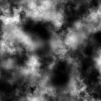
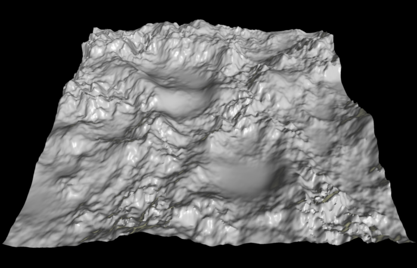
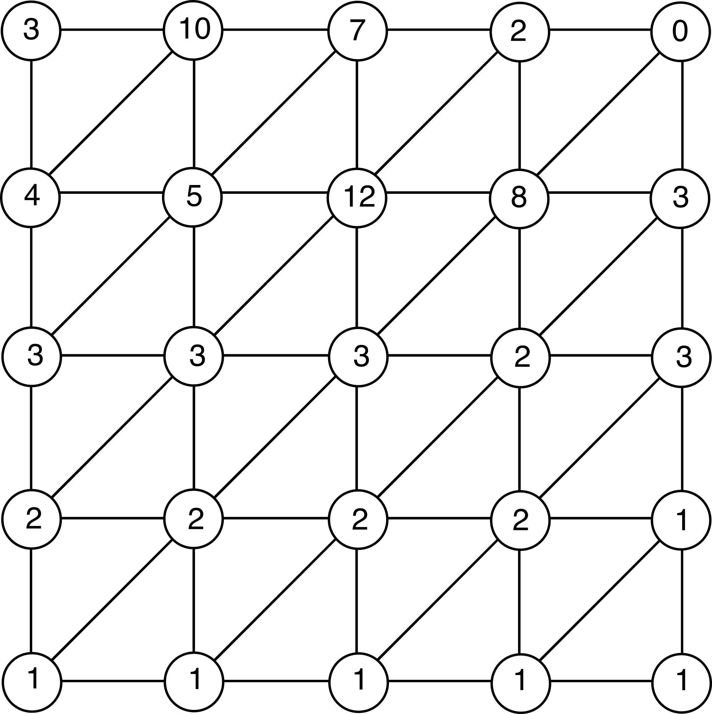
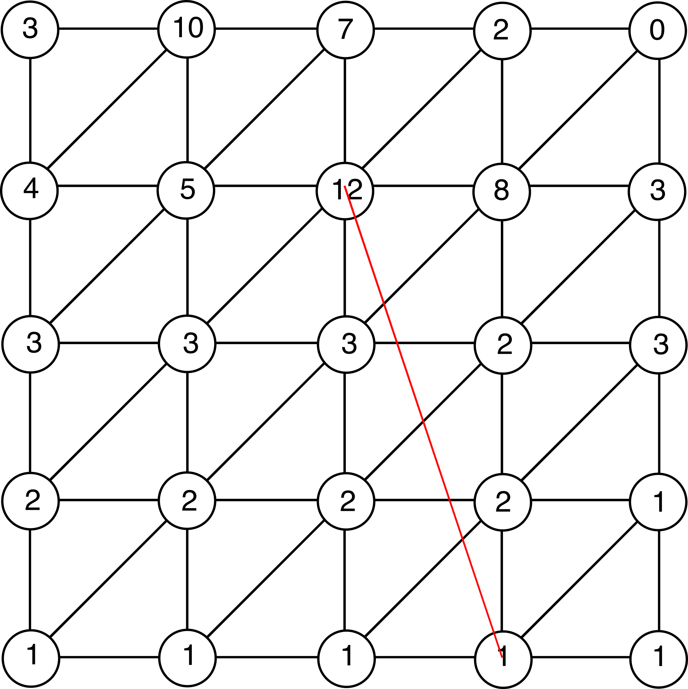
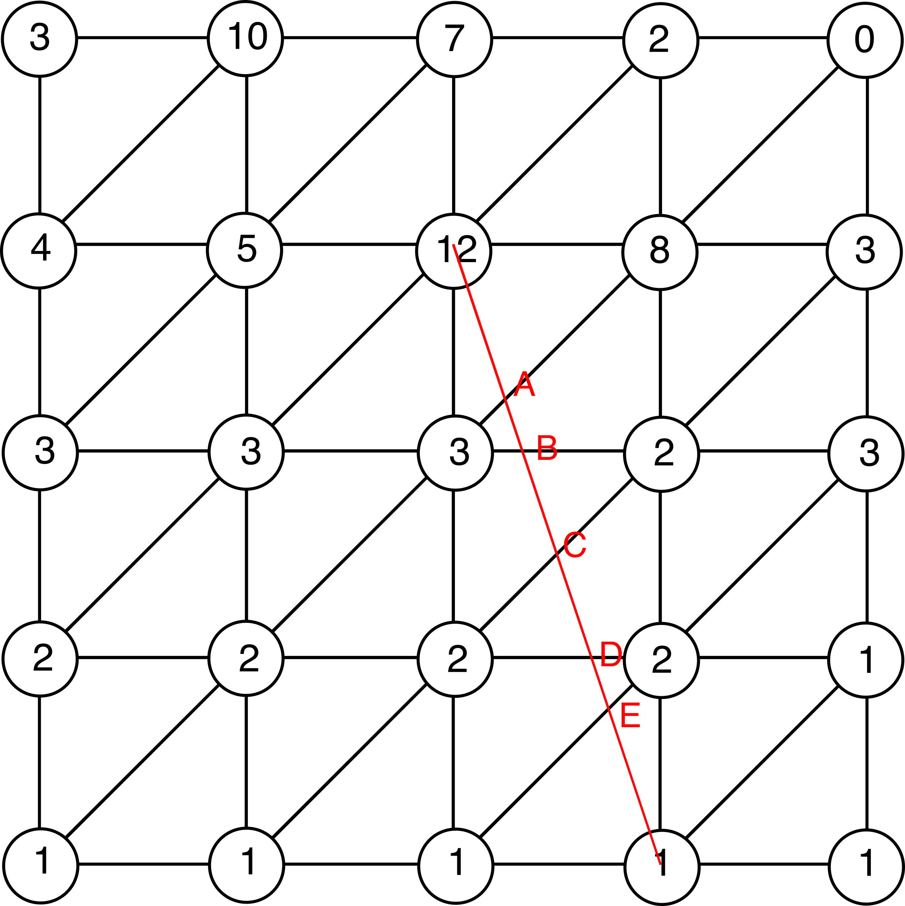
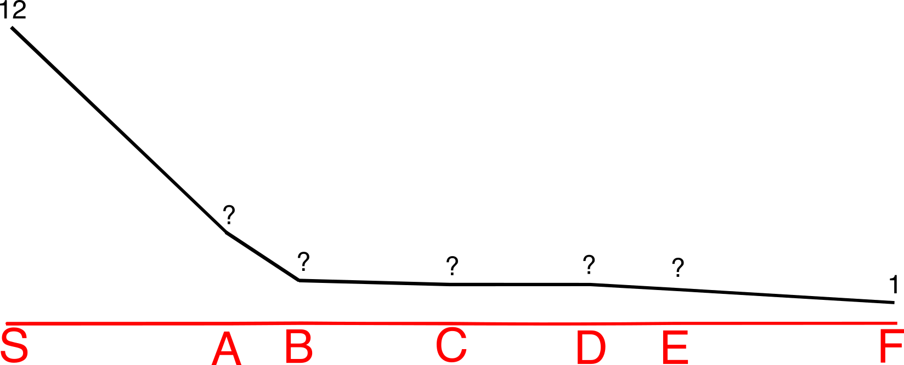
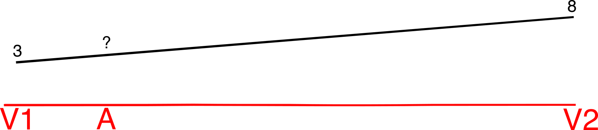
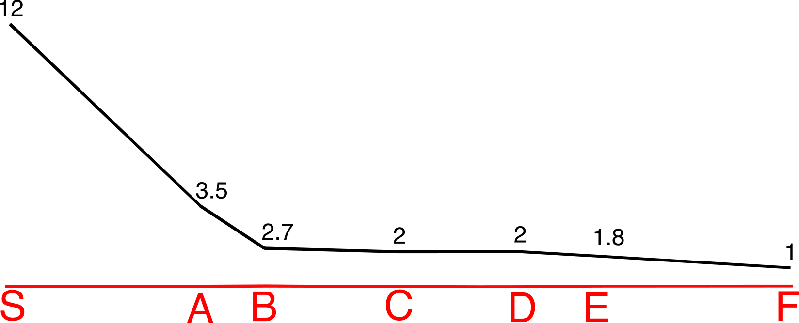
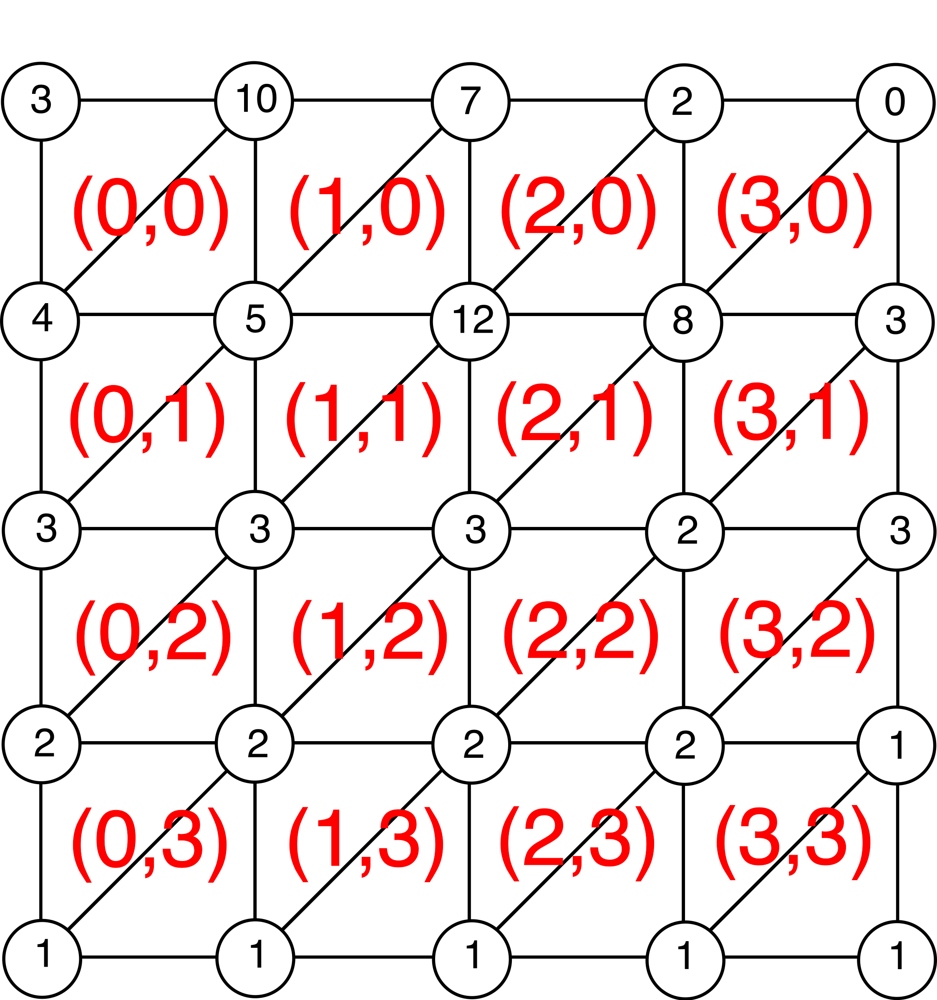

# SurfaceDistanceCalculator
Given two 512x512 heightmaps, computes the surface distance between two points and prints the difference

## Requirements
Python 3.8

## Installation
1. Create a virtual environment via `python -m venv surf_dist`
2. Activate the virtual environment with `source surf_dist/bin/activate`
3. Install the needed packages via `pip install numpy argparse shapely`

## Running
You can run the code via `python surf_dist.py -startX 0 -startY 0 -endX 511 -endY 511`

You can find the supported arguments in the following table

Parameter name | Required | Description
--- | --- | ---
startX | Yes | Image X coordinate of the starting point
startY | Yes | Image Y coordinate of the starting point
endX | Yes | Image X coordinate of the ending point
endY | Yes | Image Y coordinate of the ending point
filePre | No | File to use as the pre data. Defaults to `data/pre.data`
filePost | No | File to use as the post data. Defaults to `data/post.data`
metersPPx | No | Meters per pixel. Defaults to 30
metersPHV | No | Meters per height value. Defaults to 11

## Jupyter
There's a jupyter notebook file which contains different visualizations of the data and the computation.

To run it please perform the following steps:
1. Install the needed packages via `pip install ipykernel jupyterlab matplotlib`. You might need to also install the `wheel` package to be able to run the previous step.
2. Add the kernel to jupyter via `python -m ipykernel install --user --name=surf_dist`
3. Run `jupyter lab` and choose the `surf_dist` kernel

# Implementation details
A [heightmap](https://en.wikipedia.org/wiki/Heightmap) is a way to store elevations in a raster image. This project assumes that each pixel stores elevation data as a 8 bit value. To account for a higher elevation range, each height value is multiplied by a factor that we'll call _metersPHV_ or _meters per height value_.

Raw heightmap | Triangulated heightmap
------------- | ----------------------
 | 

For the purpose of calculating the surface distance we can imagine a triangular regular mesh having each vertex at the center of each pixel and containing the elevation value.

The distance between each vertex is what we call _metersPPx_ or _meters per pixel_

Let's say that we want to go from pixel (2,1) to pixel (3,4) as seen in the image below

**Step 1:** First we need to find the intersections between our path (the red line) and the triangle mesh, labeled A, B, C, D and E in the image below

If we knew the height on each of the intersection points, we would be able to compute the path profile and then, compute the surface distance from it

So the question, once we have the intersection points is how to compute the height of each one of those points. Trigonometry to the rescue!
Below you'll find a representation of A, and the vertices that point shares via the common edge, the vertex V1 at (2,2) and the vertex V2 at (3,1).

**Step 2:** Knowing the distance between V1 and A and between V1 and V2, we can interpolate the height at point A.

Applying the same method to all the intersection points we can compute the height on each of those finally having the complete path profile.

**Step 3:** Now, knowing all the distances between points and the heights of each one, we can compute the surface distance by adding the hypotenuse of each one of the triangles.

## Avoiding unneeded intersections
To further explain how to avoid doing unneeded intersections, we need to define some things:
- Grid cell: A group of 4 vertices that form a quad. Below you can find all the cells on the grid.

Notice that the index of a given cell is the same as its top-left vertex.
- **Top edge:** Given a cell, the top edge is the one that goes from the top-left vertex to the top-right vertex
- **Bottom edge:** Given a cell, the bottom edge is the one that goes from the bottom-left vertex to the bottom-right vertex
- **Left edge:** Given a cell, the left edge is the one that goes from the top-left vertex to the bottom-left edge
- **Right edge:** Given a cell, the right edge is the one that goes from the top-right vertex to the bottom-right one
- **Diagonal edge:** Given a cell, the diagonal edge is the one that goes from the top-right vertex to the bottom-left vertex

Now, depending on the direction the path goes by, we can avoid doing unnecessary intersections:
- If the path goes across the first quadrant, we only need to check the diagonal, top and right edges of a given cell. All other edges are impossible to intersect due to given direction.
- If the path goes across the second quadrant, we need to check the diagonal, top and left edges
- If the path goes across the third quadrant, we need to check the diagonal, bottom and left edges
- If the path goes across the fourth quadrant, we need to check the diagonal, bottom and right edges

## Special cases
### Axis aligned traversals
A simpler traversal happens when the path is aligned with a column or a row.
When this happens we don't need to compute neither the intersections (because the vertices along the way will be the needed points) nor the height of the intersections (because being a vertex, it already has a given height).
When that happens, we can go directly to the third step of the method explained above to compute the surface distance because we already have all the required information.
### Limiting cells
Due to the fact that cells are indexed via the top-left vertex and that we do the traversal from cell to cell, we need to change the start and ending cells of the traversal in some situations to avoid doing extra intersections and going out of bounds:
- If the path goes across the first quadrant, the ending cell will be the left-cell of the one containing the left-vertex. Otherwise the traversal will do extra intersections. The starting cell will be the one above the cell indexed by the starting point.
- If the path goes across the second quadrant, the ending cell will be the upper-left neighbor cell of the one indexed by the end vertex. Otherwise the traversal will skip the intersections of the cell indexed by the ending point. In addition, we need to change the starting cell in a similar way.
- Finally, if the path goes across the third quadrant, the ending cell will be the one above the cell indexed by the ending point, and the starting cell will be the left neighbor cell.